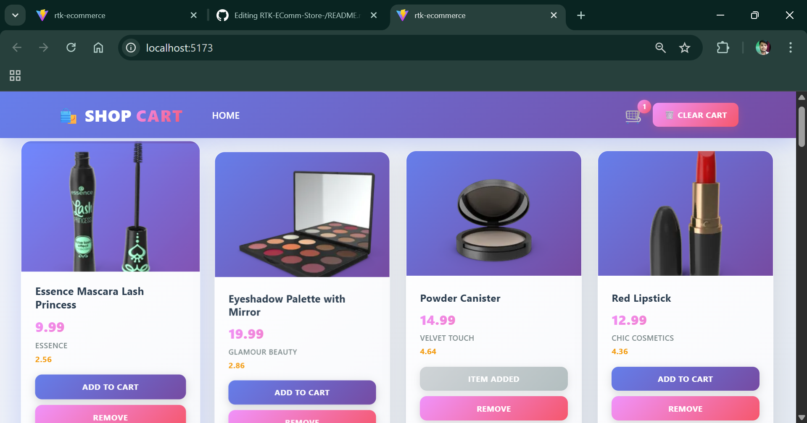

# RTK E‑Comm Store

[](#)
[](#)
[](#)
[](#)
[](LICENSE)

A modern, fast, and scalable e-commerce storefront built with React + Vite, leveraging Redux Toolkit (RTK) and RTK Query for state management and data fetching. Designed as a starter template for building production-ready online stores with clean architecture and developer ergonomics in mind.

---

## Demo




Live demo: <!-- Add your deployed demo URL here -->

---

## Key features

- Product listing, filtering, and search
- Shopping cart with persisted state
- Checkout flow skeleton (orders, shipping, payments integration ready)
- Auth-ready structure (sign-in/sign-up placeholders)
- Optimistic updates, cache invalidation & efficient data fetching via RTK Query
- Mobile-first responsive UI and accessible components
- Built with Vite for instant dev feedback and fast production builds

---

## Tech stack

- React 18
- Vite
- Redux Toolkit (RTK) + RTK Query
- React Router
- CSS Modules / Tailwind / Styled Components (pick one — update accordingly)
- Optional: TypeScript (if repo uses TS)

---

## Quick start

Prerequisites:
- Node.js >= 18
- npm, yarn or pnpm

1. Clone the repo
```bash
git clone https://github.com/07anuragsingh/RTK-EComm-Store-.git
cd RTK-EComm-Store-
```

2. Install dependencies
```bash
npm install
# or
yarn
# or
pnpm install
```

3. Setup environment variables

Create a `.env` (or `.env.local`) file at project root and add variables needed for API endpoints, keys, etc:

```
VITE_API_BASE_URL=https://api.example.com
VITE_STRIPE_PUBLIC_KEY=pk_test_xxx
# Add other keys as needed
```

4. Start dev server
```bash
npm run dev
# or
yarn dev
# or
pnpm dev
```

5. Build for production
```bash
npm run build
```

6. Preview production build locally
```bash
npm run preview
```

---

## Available scripts

- `dev` — run Vite dev server
- `build` — create a production build
- `preview` — preview the production build locally
- `lint` — run ESLint
- `format` — run Prettier or formatting scripts
- `test` — run unit/integration tests (if present)

Update package.json scripts to match your setup.

---

## Project structure (suggested)

```
/src
  /api           # RTK Query services
  /app           # store configuration, root reducer
  /components    # reusable UI components
  /features      # feature slices (cart, products, auth)
  /pages         # route pages
  /routes        # route config
  /styles        # global styles / tokens
  main.jsx
```

---

## RTK & RTK Query tips

- Keep API endpoints in dedicated RTK Query services (e.g. src/api/productsApi.ts)
- Use `createEntityAdapter` for normalized product lists
- Invalidate tags for cart/order changes to refresh relevant data automatically
- Use `selectFromResult` to optimize expensive selectors in components

---

## Deployment

This app builds into static assets and can be deployed to platforms like:
- Vercel
- Netlify
- Cloudflare Pages
- Any static host behind a CDN

Example: Deploy to Vercel
1. Connect the GitHub repo
2. Set environment variables in the Vercel dashboard
3. Set build command: `npm run build`
4. Set output directory: `dist`

---

## Contributing

Contributions are welcome! A good workflow:
1. Fork the repo
2. Create a branch: `feat/your-feature`
3. Commit changes with clear messages
4. Open a PR describing the change and motivation

Please follow existing code style and run linters/tests before opening a PR.

---

## License

This project is licensed under the MIT License — see the [LICENSE](LICENSE) file for details.

---

## Acknowledgements

- Vite team — for the fast dev experience
- Redux Toolkit — for sane state management
- Any UI libraries or icons you used (list them here)

---
